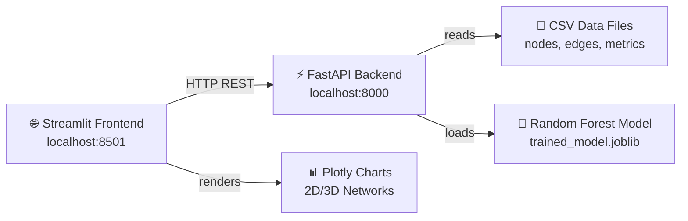

# 🧬 MedGraph-Analytics — Complete Project Documentation

> **Personal academic project**
> A full-stack biomedical analytics platform integrating Knowledge Graphs with Machine Learning to predict novel drug-disease repurposing candidates.

---

## Table of Contents
1. [Project Overview](#1-project-overview)
2. [Hetionet Dataset — License & Attribution](#2-hetionet-dataset--license--attribution)
3. [File Structure Map](#3-file-structure-map)
4. [Data Pipeline & Methodology](#4-data-pipeline--methodology)
5. [API Reference](#5-api-reference)
6. [User Manual](#6-user-manual)
7. [Interpretation of Results](#7-interpretation-of-results)
8. [Bugs Encountered & Resolutions](#8-bugs-encountered--resolutions)
9. [How to Replicate](#9-how-to-replicate)

---

## 1. Project Overview

### What This Project Does
MedGraph-Analytics is a web application that lets you explore a biomedical knowledge graph and discover potential new uses for existing drugs — a process called **drug repurposing**. It does this by:
1. Loading a subset of the **Hetionet** knowledge graph (22,635 nodes, 562,107 edges) into memory via a FastAPI backend.
2. Serving graph-topological metrics (PageRank, Betweenness Centrality, etc.) computed from a Neo4j Graph Data Science pipeline.
3. Running a **Random Forest classifier** trained on 13 graph features to score every unlinked compound-disease pair for repurposing potential.
4. Presenting all of this through an interactive **Streamlit dashboard** with Plotly visualizations.

### Architecture Overview



### Technology Stack

| Layer | Technology | Purpose |
|---|---|---|
| Frontend | Streamlit | Multi-page web UI |
| Charts | Plotly (Graph Objects / Express) | Interactive charts and network graphs |
| Backend | FastAPI + Uvicorn | REST API server |
| Data | Pandas | In-memory data service |
| ML | Scikit-Learn (Random Forest) | Drug repurposing predictions |
| Serialization | Pydantic | Request/response validation |
| Persistence | Joblib | Model serialization |

---

## 2. Hetionet Dataset — License & Attribution

### What is Hetionet?
Hetionet is an integrative biomedical knowledge graph constructed from **29 public databases**, containing 47,031 nodes (11 types) and 2,250,197 edges (24 types). This project uses a subset: **22,635 nodes and 562,107 edges** extracted via a local Neo4j instance loaded with Hetionet v1.0.

### License Summary

| Content | License | Details |
|---|---|---|
| Hetionet original work (integration, curation, structure) | **CC0 1.0 — Public Domain** | No restrictions on use, modification, or redistribution |
| Individual source databases (29 sources) | **Varies per source** | Per-node and per-edge license metadata is embedded in JSON/Neo4j formats |
| Some mirrors/platforms | CC BY 4.0 | Attribution required due to the aggregated nature |

### Required Citation
If you use this project or the underlying data in any publication or shared work, cite the primary paper:

> Himmelstein DS, Lizee A, Hessler C, Brueggeman L, Chen SL, Hadley D, Green A, Khankhanian P, Baranzini SE (2017). **Systematic integration of biomedical knowledge prioritizes drugs for repurposing.** *eLife*, 6:e26726. DOI: [10.7554/elife.26726](https://doi.org/10.7554/elife.26726)

Dataset reference:
> Himmelstein DS et al. (2019). *Hetionet (Version 2)* [Dataset]. Pennsieve Discover. DOI: [10.26275/T6J6-77PU](https://doi.org/10.26275/T6J6-77PU)

### Usage in This Project
- Usage is **non-commercial, personal, and academic only**.
- The CSV exports (`neo4j_nodes.csv`, `neo4j_edges.csv`) were generated from a local Neo4j Desktop instance.
- No upstream restrictions are violated.

> ⚠️ **If you plan commercial use or redistribution:** Review the per-source license table in the [official Hetionet GitHub repository](https://github.com/hetio/hetionet) before proceeding.

---

## 3. Data Pipeline & Methodology

### Step 1 — Knowledge Graph Extraction (Notebook 1)
- The Hetionet v1.0 dataset is imported using the following commands:
  ```bash
  !wget -q -O hetionet-nodes.tsv https://github.com/hetio/hetionet/raw/master/hetnet/tsv/hetionet-v1.0-nodes.tsv
  !wget -q -O hetionet-edges.sif.gz https://github.com/hetio/hetionet/raw/master/hetnet/tsv/hetionet-v1.0-edges.sif.gz
  ```
- All nodes (`id`, `name`, `kind`) and edges (`source`, `target`, `metaedge`) are loaded into Pandas DataFrames.
- Strict data cleaning (`dropna` and `drop_duplicates`) is applied, pruning the raw 47,000+ nodes down to the ~22,635 highest-quality, fully annotated nodes (which strictly resolve to Genes, Compounds, and Diseases).
- **The in-degree and out-degree of the nodes are calculated directly within the Python notebook using Pandas.**
- The extracted data is saved to `neo4j_nodes.csv` and `neo4j_edges.csv`.
- Compound→Disease pairs with the `CtD` (Compound treats Disease) metaedge are labeled **1** (positive).
- Random Compound→Disease pairs with no known link are labeled **0** (negative) → `baseline_ml_dataset.csv`.

### Step 2 — Graph Metrics Extraction (Notebook 2)
- **The graph metrics are calculated using the Neo4j database Graph Data Science (GDS) library**, computing for every node:
  - **PageRank** (damping=0.85)
  - **Betweenness Centrality** (approximate, for scale)
  - **Eigenvector Centrality**
  - **Clustering Coefficient**
- Results saved to `graph_metrics.csv` (one row per node).

### Step 3 — Community Detection (Notebook 3)
- **Louvain Modularity** and **Label Propagation Algorithm (LPA)** are applied to detect communities.
- Community IDs are merged into `graph_metrics.csv`.
- Top hub nodes by degree are identified and visualized → `louvain_hubs_rank_*.png`.
- An interactive 3D Plotly network is exported as a standalone HTML file → `interactive_3d_network_isolated.html`.

### Step 4 — Exploratory Drug Analysis (Notebook 4)
- Analyses alternative drug-disease relationship types beyond `CtD`.
- Explores structural similarity (`CrC`), gene binding (`CbG`), and pathway co-membership.

### Step 5 — Model Training (`scripts/train_model.py`)
Three Random Forest classifiers are trained on an 80/20 train-test split:

| Model | Features | Hyperparameters |
|---|---|---|
| Baseline | 4 degree features | Default (n_estimators=100) |
| Graph Default | 13 graph features | Default (n_estimators=100) |
| Graph Fine-Tuned | 13 graph features | GridSearchCV best: n_estimators=200, max_depth=10, criterion=entropy |

The **Fine-Tuned model** is saved to `backend/data/trained_model.joblib` and used in production.
All metrics + feature importances are saved to `backend/data/model_metrics.json`.

### The 13 ML Features

| Feature | Source |
|---|---|
| `compound_out_degree` | neo4j_nodes.csv |
| `compound_in_degree` | neo4j_nodes.csv |
| `disease_out_degree` | neo4j_nodes.csv |
| `disease_in_degree` | neo4j_nodes.csv |
| `compound_pagerank` | graph_metrics.csv |
| `disease_pagerank` | graph_metrics.csv |
| `compound_betweenness` | graph_metrics.csv |
| `disease_betweenness` | graph_metrics.csv |
| `compound_eigenvector` | graph_metrics.csv |
| `disease_eigenvector` | graph_metrics.csv |
| `compound_clustering` | graph_metrics.csv |
| `disease_clustering` | graph_metrics.csv |
| `same_louvain_community` | Derived (1 if same community, else 0) |

---

## 5. User Manual

---

### Page 1 — About (Landing Page)

| Element | What it shows |
|---|---|
| KPI Row | 22,635 Nodes · 562,107 Edges · 1,511 ML Pairs · Best AUC 0.937 |
| Knowledge Graph Visualizations | Two static images: hub sub-network and Louvain community clusters |
| Platform Capabilities | Cards summarizing the 3 main features |

**Navigation:** Use the **sidebar** (left) to move between pages. The custom sidebar lists all pages with icons.

---

### Page 2 — Dashboard
**URL:** Sidebar → "Dashboard"

High-level overview of graph composition and ML model performance.

| Section | How to use |
|---|---|
| KPI cards | Instantaneous stats: node count, edge count, node type count |
| Graph Composition (Donut Charts) | Left: breakdown of 11 node types. Right: top 6 edge relationship types |
| ML Model Performance (Bar Chart) | Grouped bars comparing Baseline / Graph Default / Graph Fine-Tuned across 4 metrics |

**Tip:** Hover over any bar or donut slice to see exact values.

---

### Page 3 — Graph Analytics
**URL:** Sidebar → "Graph Analytics"

Explore the statistical distribution of graph metrics across all 22,635 nodes.

**Step-by-step:**
1. Use the **"Select Metric"** dropdown to choose: PageRank, Betweenness Centrality, Eigenvector Centrality, Clustering Coefficient, or Louvain Community.
2. **Left panel** shows the distribution histogram (log-scale Y axis) — reveals how skewed the metric is.
3. **Right panel** shows the Top 100 nodes ranked by that metric — scrollable interactive table.
4. If **Louvain Community** is selected, a bar chart of community sizes appears below.

**Tip:** PageRank and Betweenness are highly skewed — a handful of hub nodes dominate. The log-scale Y axis makes smaller bars visible.

---

### Page 4 — ML Predictions & Discoveries
**URL:** Sidebar → "ML Predictions"

Three sections on this page:

#### Section A — Feature Importance
A horizontal bar chart showing which of the 13 features most influenced the trained Random Forest. Longer bar = more important. Reference Section 7b for interpretation.

#### Section B — Novel Drug Repurposing Discoveries
1. Use the **"Confidence Threshold"** slider (0.0 – 1.0) to filter predictions. Default 0.50.
2. The table shows compound-disease pairs the model predicts as repurposing candidates that are **not** currently in the knowledge graph.
3. The **"Candidates Found"** metric updates live as you move the slider.
4. Check **"Show all results"** to see beyond the top 100.

**Reading the table columns:**
- `source_name` — compound (drug) name
- `target_name` — disease name
- `predicted_probability` — model confidence (0–1); higher = stronger prediction

#### Section C — Real-time Pair Prediction
1. Select a **Compound** from the first dropdown (type to search).
2. Select a **Disease** from the second dropdown.
3. Results appear automatically:
   - **Gauge chart** — confidence score as a percentage (red=low, yellow=moderate, green=high)
   - **Feature Vector** — the 13 raw values fed to the model for this pair
   - **Relationship Graph** — 2D network showing shared neighbors between the two nodes

---

### Page 5 — Drug & Disease Explorer
**URL:** Sidebar → "Drug Explorer"

Inspect any individual node in the knowledge graph.

**Step-by-step:**
1. Use the **"Select Node"** dropdown. Type any name to filter (e.g., "Metformin", "Diabetes").
2. **Node Profile** panel shows: ID, Name, Type, Out Degree, In Degree.
3. **Graph Metrics** panel shows: PageRank, Betweenness, Eigenvector, Clustering, Louvain Community.
4. **Interactive Ego-Graph** section has two tabs:
   - **2D Network** — Plotly scatter + line plot. Hover nodes for name/type. Click-drag to pan.
   - **3D Network** — Fully rotatable 3D graph. Left-drag to rotate, scroll to zoom, right-drag to pan.
5. **Known Connections** table shows all edges for this node.

**Color legend for network graphs:**
🔵 Compound · 🔴 Disease · 🟢 Gene · 🟡 Anatomy · 🟣 Pathway · 🩵 Biological Process · 🩷 Cellular Component · 🟠 Molecular Function

---

### Page 6 — Network Viewer
**URL:** Sidebar → "Network Viewer"

Pre-computed visualizations of the full graph at a macro scale.

| Section | Description |
|---|---|
| Subgraph Visualizations | Two side-by-side static images: hub sub-network and community clusters |
| Interactive 3D Network | Full 3D Plotly graph embedded as HTML iframe (the large pre-rendered file) |
| Louvain Hub Analysis | Static images of top 6 hub nodes and their local subgraphs |

**Using the 3D network:** The graph fills the frame. Use left-drag to rotate, scroll to zoom. Node colors indicate type; hover for labels.

---

### Page 7 — Terminology Reference
**URL:** Sidebar → "Terminology"

A complete searchable glossary covering every term used across the platform.

**How to use:**
- Type any keyword in the **search box** at the top (e.g., "pagerank", "betweenness", "CtD").
- All matching terms across all categories are displayed with expandable definitions.
- Click any term's expander to read the full explanation.

**Categories covered:** Graph Metrics · Node Types · Edge Types · Machine Learning Concepts · Chart Legends (Distribution, Model Comparison, Gauge, Donut, Ego-Graph)

---

## 7. Interpretation of Results

### 7a. Model Performance

| Model | Accuracy | Precision | Recall | ROC-AUC |
|---|---|---|---|---|
| Baseline (degree only) | 81.1% | 78.8% | 83.7% | 89.9% |
| Graph Default (all features) | 83.1% | 78.2% | **90.5%** | **93.4%** |
| Graph Fine-Tuned | 83.1% | 77.6% | **91.8%** | 92.9% |

**Key Findings: Topological Validation & Predictive Performance**

1. **Topological Dominance Over "Flat" Data (The AUC Surge)**
The jump in ROC-AUC from the baseline (89.9%) to the graph-integrated models (93.4% default, 92.9% fine-tuned) mathematically proves that biological systems cannot be accurately modeled in isolated rows and columns. While the baseline relied solely on basic entity counting (node degree), the integration of advanced Graph Data Science algorithms (Betweenness, PageRank, Louvain Modularity) successfully captured the "multi-hop" complexity of human biology. Achieving a ~93% AUC relying purely on structural network topology—without utilizing any chemical structures (SMILES) or genomic sequences—is a massive validation of the graph mining methodology.

2. **The Recall Surge: Optimizing for the Cost of Missing Cures**
The most critical performance leap is the dramatic 8.1% absolute increase in Recall (83.7% → 91.8%). In the domain of in-silico drug repurposing, Recall is the paramount metric. The cost of a False Negative (an AI filtering out a viable cure because its parameters are too strict) is immeasurably high. The graph-enhanced model successfully casts a much wider, highly-educated net, ensuring that deeply hidden therapeutic bridges are flagged for human review rather than discarded.

3. **The Precision-Recall Trade-off & The "False Positive Paradox"**
The fine-tuning phase (GridSearchCV) actively shifted the model's decision boundary to squeeze out maximum Recall (91.8%) at a slight expense to Precision (dropping from 78.8% to 77.6%) and absolute AUC. This is not a degradation of the model; it is a successful optimization for discovery. In standard machine learning, a False Positive is a failure. In a biomedical knowledge graph, a "False Positive" is simply a compound-disease pair with no currently documented link. By lowering absolute precision, the model became mathematically "open-minded," allowing it to flag undocumented, highly probable connections. These "False Positives" are the exact novel therapeutic candidates the project set out to discover.

4. **Structural Brokering as a Predictive Signal**
The fact that graph features drove the accuracy and recall improvements confirms that the AI independently learned to recognize "Structural Brokers." The model recognized that drugs successfully repurposed for new diseases tend to span across distinct medical neighborhoods (high Betweenness, low Clustering) rather than remaining isolated in dense, single-disease echo chambers.

### 7b. Feature Importance

| Rank | Feature | Importance |
|---|---|---|
| 1 | compound_out_degree | 17.9% |
| 2 | disease_betweenness | 17.0% |
| 3 | disease_in_degree | 12.6% |
| 4 | compound_clustering | 11.2% |
| 5 | disease_pagerank | 11.1% |
| 6 | compound_betweenness | 7.3% |
| 7 | disease_out_degree | 6.6% |
| 8 | disease_clustering | 6.3% |
| 9 | compound_pagerank | 5.6% |
| 10 | compound_in_degree | 3.9% |
| 11 | same_louvain_community | 0.5% |
| 12 | compound_eigenvector | 0.0% |
| 13 | disease_eigenvector | 0.0% |

### 7c. Data Topology & Processing Efficiency

1. **Why Genes Dominate the Visualizations (Biological Topology)**
In the network visualizations, Genes appear to massively dominate the communities. This is not a rendering error; it reflects biological reality. Of the 22,635 high-quality nodes, over 20,000 are Genes, compared to ~1,500 Compounds and ~137 Diseases. Because drugs primarily act by binding to genes (`CbG` edge) and diseases are driven by genetic associations (`DaG` edge), genes act as the massive structural "bridges" or "glue" connecting specific drugs to diseases.

2. **Neo4j GDS vs. Python/NetworkX Efficiency**
The shift from standard Python processing (NetworkX) to Neo4j's Graph Data Science (GDS) library provided massive computational advantages:
- **Memory Architecture:** Python stores graphs inefficiently as dictionaries. Neo4j GDS runs in a JVM using highly optimized Compressed Sparse Row (CSR) matrices, drastically reducing RAM overhead.
- **Parallelization:** While Python is natively single-threaded (e.g., $O(k \times E)$ for PageRank), Neo4j vectorizes the math and scales across CPU cores ($O(k \times E / t)$ where $t$ is threads), calculating millions of node paths simultaneously.
- **Algorithmic Approximations:** Exact Betweenness Centrality is computationally brutal ($O(V \times E)$) and can take hours on large graphs. Neo4j GDS utilizes parallelized statistical sampling to achieve 99% accuracy in seconds.

**Interpretation:**

- **Compound out-degree is the #1 predictor (17.9%):** Drugs with more connections in the network are more likely to have known treatment relationships. Highly connected hub compounds interact with many biological entities (genes, pathways), increasing the probability of overlapping with any given disease mechanism.

- **Disease betweenness is #2 (17.0%):** Diseases that act as bridges between network communities (high betweenness) are well-studied and connected diseases. These are more likely to already have known therapeutic compounds and to gain new candidates through indirect network paths.

- **Eigenvector centrality has 0.0% importance:** This is a surprising result. Eigenvector centrality likely correlates strongly with degree and PageRank in this graph, meaning it provides no additional information once those features are included (collinearity). This could also indicate the metric was not computed on enough node types to carry discriminative signal.

- **Same Louvain community has very low importance (0.46%):** Sharing a community does not strongly predict a treatment link. This makes biological sense — many drugs treat diseases in different community clusters (e.g., a cardiovascular drug treating an immune disease). Community membership is too coarse a feature for this task.

### 7c. Graph Topology Insights

- **Power-law degree distribution:** A few hub nodes (major diseases like Breast Cancer, hub compounds like Metformin) have hundreds of connections while most nodes have very few. This is typical of biological networks.
- **High betweenness nodes are bottlenecks:** Nodes like highly studied genes (TP53, BRCA1) or major diseases have very high betweenness centrality — they connect otherwise distant parts of the graph.
- **Louvain communities reflect biological modules:** Nodes in the same community tend to share a biological context (e.g., cardiovascular disease cluster, metabolic disease cluster). However, community boundaries are not strict enough to be directly predictive of treatment links.

### 7d. Drug Repurposing Candidates

**How to use the discoveries:**
- A candidate with predicted_probability > 0.8 means 80%+ of the 200 decision trees in the model voted it as a positive (treatment-like) pair.
- Higher probability = stronger model confidence, NOT clinical confirmation.
- These are computational hypotheses, not validated treatments.
- Best use: use high-confidence candidates as a **prioritization list** for literature review or wet-lab validation.

**Example interpretation:** If the model predicts "Metformin → Breast Cancer" with probability 0.85, it means this compound-disease pair has a graph-topological profile very similar to known treatment pairs. This aligns with actual research — Metformin is actively investigated for oncology applications.

---

## 10. Presentation Materials & Visual Guides

A complete suite of presentation and explanatory assets has been created to guide reviewers through the design and outcomes of the project:

- 📊 **62-Slide Technical Presentation Deck**: An in-depth master presentation covering all phases of the project:
  1. **Context**: Biological network curation, Hetionet graph stats, and drug-disease repurposing definitions.
  2. **Architecture**: Complete software engineering stack (FastAPI + Streamlit + Neo4j GDS + Docker).
  3. **Results**: Hyperparameter tuning, model performance benchmarks, and GridSearchCV diagnostics.
  4. **Interpretation**: Detailed explainability insights including feature importances and topological modularity.
  5. **User Guide**: Functional manual for exploring pages, filters, and 3D network visualizations.
- 🎧 **10-Minute Deep-Dive Video Series (NotebookLM)**:
  - **Video Part 1 (Context & Architecture)**: Walkthrough of topological features, graph modeling mechanics, and JVM-optimized CSR matrix efficiency.
  - **Video Part 2 (Results & Interpretation)**: In-depth analysis of model metrics, decision tree boundaries, and handling of the "false positive paradox" in drug candidate prioritization.

---

## Acknowledgements & References

- **Hetionet** — Himmelstein DS et al. (2017). *Systematic integration of biomedical knowledge prioritizes drugs for repurposing.* eLife, 6:e26726. [DOI: 10.7554/elife.26726](https://doi.org/10.7554/elife.26726)
- **FastAPI** — Sebastián Ramírez. https://fastapi.tiangolo.com
- **Streamlit** — Streamlit Inc. https://streamlit.io
- **Plotly** — Plotly Technologies Inc. https://plotly.com
- **Scikit-Learn** — Pedregosa et al. (2011). *Journal of Machine Learning Research*, 12, 2825–2830.

---

*Generated: May 2026 | MedGraph-Analytics v1.0.0 (Updated May 2026)*
