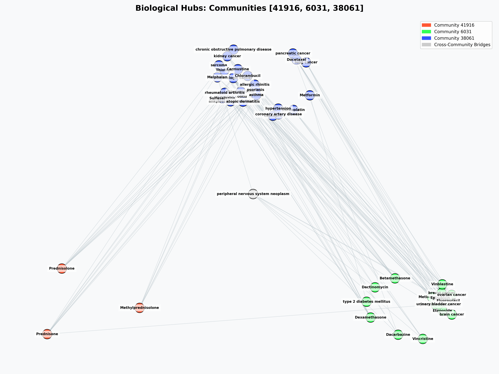
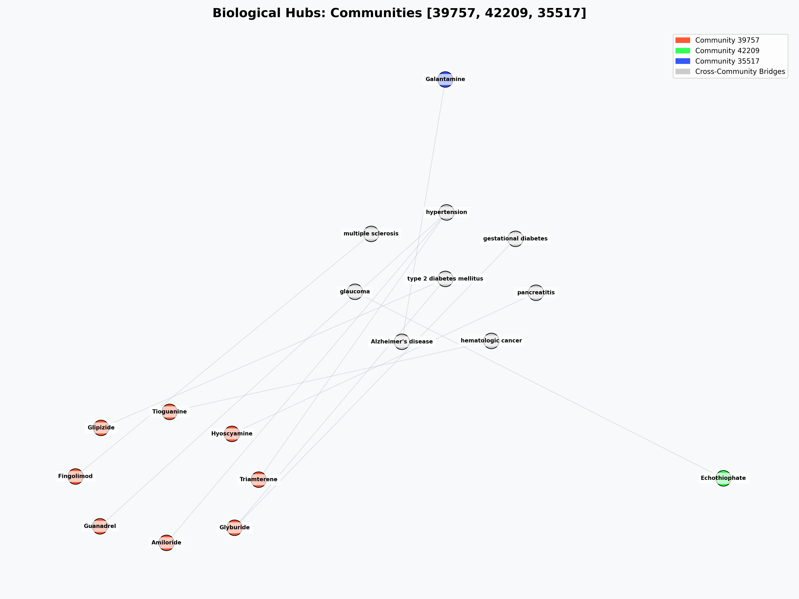

# 🧬 MedGraph-Analytics — Biomedical Knowledge Graph & ML Showcase

> 🔒 **Codebase Status:** The core engine, backend REST API, and data pipelines are maintained in a private repository to protect proprietary modeling pipelines. Access to the full source code can be provided to recruiters, hiring managers, or academic evaluators upon request.

---

## 🚀 Project Overview
MedGraph-Analytics is an end-to-end full-stack biomedical platform that leverages Graph Data Science (GDS) and Machine Learning to predict novel drug-disease repurposing candidates...


🌐 **Live Website:** [medgraph-analytics.streamlit.app](https://medgraph-analytics-mqjjpkrx5owl6ajxd7pzvx.streamlit.app/)

MedGraph-Analytics is a professional, high-performance web application designed for advanced biomedical research. It allows researchers to explore complex biological networks, analyze multi-dimensional graph topology, and utilize a fine-tuned Random Forest classifier to discover hidden therapeutic relationships between compounds and diseases.

---

## 📸 Top 6 Community Clusters
| Hub Ranks 1-3 | Hub Ranks 4-6 |
|:---:|:---:|
|  |  |

---

## ✨ Key Features

- 📊 **Executive Dashboard**: High-level overview of graph composition and ML model performance metrics.
- 📈 **Graph Analytics**: Real-time analysis of PageRank, Betweenness Centrality, Eigenvector Centrality, and Louvain modularity across 22,000+ nodes and 560,000+ edges.
- 🤖 **ML Predictions**: Discover novel drug-repurposing candidates using a Random Forest model trained on 13 graph-topological features.
- 🧭 **Drug Explorer**: Interactive 2D and 3D ego-graph visualizations for any node in the Hetionet knowledge graph.
- 🕸️ **Network Viewer**: Macro-scale visualization of the entire biological network and community hubs.
- 📖 **Terminology**: Comprehensive glossary of all graph metrics, node types, and ML concepts used.

- ⚡ **Fast-API Backend**: Millisecond API latency powered by FastAPI with comprehensive in-memory data structures.
- 🎨 **Glassmorphism UI**: A premium, high-fidelity dark theme with dynamic Plotly charts and animated particle backgrounds.
- 🐳 **Docker Integrated**: Fully containerized setup for seamless replication across any environment.

---

## 🛠️ Technology Stack

| Layer | Technologies |
|---|---|
| **Frontend** | 🌐 Streamlit, 📊 Plotly, 🎨 Vanilla CSS (Glassmorphism) |
| **Backend** | ⚡ FastAPI, 🐍 Python 3.11, 🐼 Pandas |
| **Machine Learning** | 🤖 Scikit-Learn (Random Forest), 🧪 Joblib |
| **Data Science** | 📉 NetworkX, 🧬 Hetionet Knowledge Graph |
| **DevOps** | 🐳 Docker, 🚀 Docker Compose, 📦 GitHub Actions |

---

## 🎥 Presentation & Video Guides

To explore this project at a high conceptual and architectural level, review the following companion assets:
- 📊 **62-Slide Technical Presentation**: A comprehensive deck detailing the Context, Architecture, Results, Interpretation, and a detailed User Guide.
- 🎧 **10-Minute Deep-Dive Video (NotebookLM)**:
  - **Part 1 (Context & Architecture)**: Explains the underlying biomedical network structure, the advantage of Neo4j GDS CSR matrices over Python, and full-stack REST orchestration.
  - **Part 2 (Results & Interpretation)**: A deep scientific dive into Random Forest optimization, recall tuning metrics, and structural brokering analysis.

---

```
📦 medgraph-analytics-showcase/
│
├── 📄 README.md
├── 📄 PROJECT_DOCUMENTATION.md
├── 📁 media/
│   ├── 📄 MedGraph-Analytics-Complete-Guide.pdf
│   ├── 🎥 Part-1-Architecting_MedGraph-Analytics.mp4
│   ├── 🎥 Part-2-Results_Interpretation_MedGraph-Analytics.mp4
└── 📄 LICENSE.md
```

---

## 📜 Dataset & Licensing

This project utilizes the **Hetionet v1.0** dataset. Hetionet is an integrative biomedical knowledge graph constructed from 29 public databases.

- **License**: Hetionet original integration is released under [CC0 1.0](https://creativecommons.org/publicdomain/zero/1.0/).
- **Attribution**: 
  > Himmelstein DS, et al. (2017). *Systematic integration of biomedical knowledge prioritizes drugs for repurposing.* **eLife**. DOI: [10.7554/elife.26726](https://doi.org/10.7554/elife.26726)

---

## 🎓 Academic Context
This platform serves as a complete technical demonstration of how Graph Data Science can be applied to complex real-world biological discovery.

---
*Developed by Afzal | MedGraph-Analytics v1.0.0 (Updated May 2026)*
